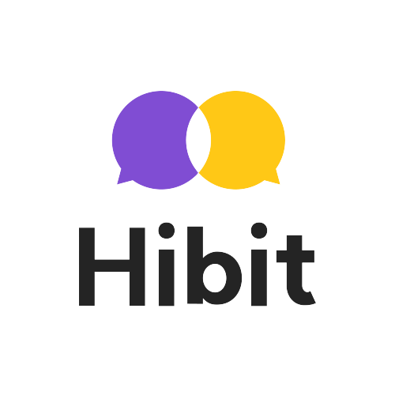
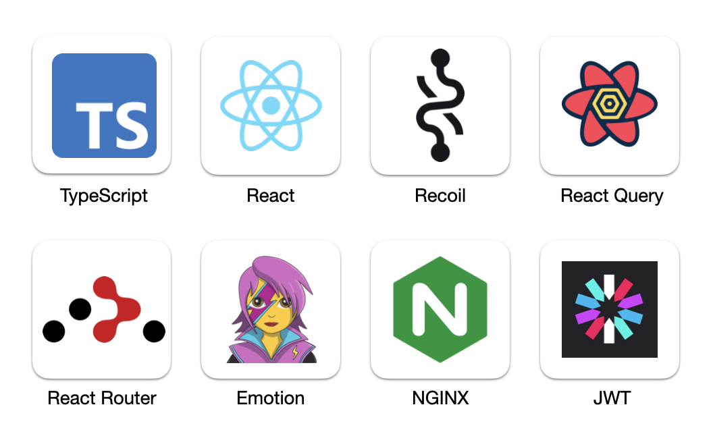
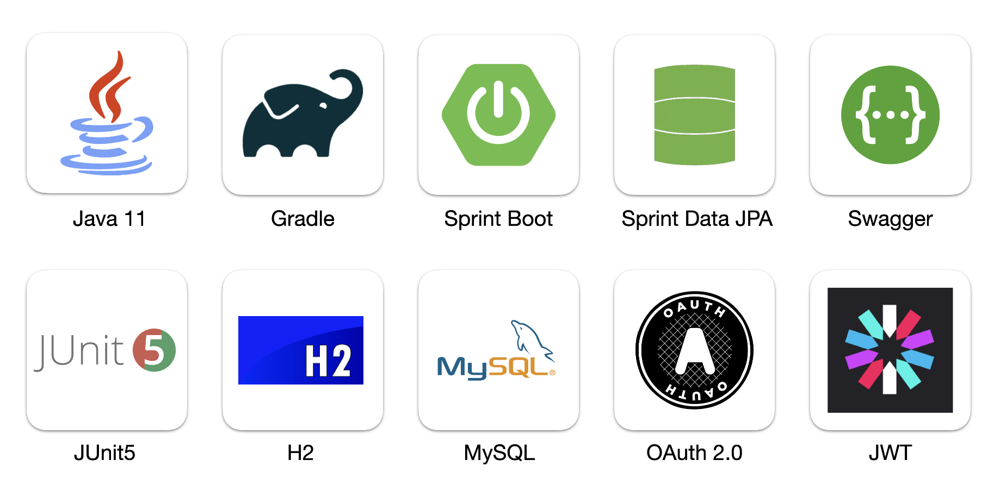
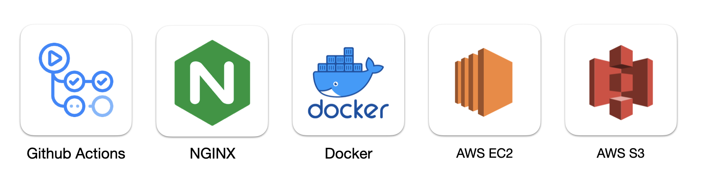

예술 기반의 소셜 디스커버리 🎨 서비스

[Linktree](https://linktr.ee/hibit.co.kr) |
[Instagram](https://www.instagram.com/hibit.co.kr/) |
[Wiki](https://github.com/hibit-team/hibit-backend/wiki) |
[Client팀 Repository](https://github.com/hibit-team/hibit-frontend)

## 🪧 서비스를 소개합니다.

`히빗`은 예술(전시)기반의 소셜 디스커버리 서비스입니다.

### 🙆🏻‍♂️ **서비스 대상자**

1. 전시회를 가고싶지만 막상 혼자 가기가 두려운 사람.
2. 예술에 대해 깊은 공감대를 형성할 수 있는 친구를 만들고 싶은 사람.
3. 전시도 보고 밥도 먹고 다양한 사람들과 친해지고 싶은 사람.

## 🏷 기능을 소개합니다.

### 🧷 기능 1: `소셜 로그인` - 간편하게 로그인할 수 있어요.

- 자주 사용하는 소셜미디어 중 하나인 `구글` 계정으로 로그인/회원가입을 할 수 있어요.

### 🧷 기능 2: `매칭` - 본인이 원하는 상대방과 연결해줘요.

- 모집자로서 게시글을 작성하고 원하는 상대방에게 매칭 초대장을 전송할 수 있어요.
- 모집자 & 신청자로서 댓글을 작성/수정/삭제하면서 쌍방향 소통할 수 있어요.
- 모집자로서 댓글을 남긴 유저 중 함께 전시회를 가고 싶은 유저에게 초대장을 보낼 수 있어요.

### 🧷 기능 3: `프로필` - 상대방의 프로필 정보를 확인할 수 있어요.

- 매칭 시 필요한 프로필 정보를 입력할 수 있어요.
- 상대방에게 노출 되는 프로필 정보의 수준을 허용 가능한 범위 내에서 선택할 수 있어요.

### 🧷 기능 4: `알림` - 매칭 결과 및 댓글에 대한 답변을 받을 수 있어요.

- 알림 목록에서 매칭 신청에 대한 결과, 댓글/대댓글 등의 알림을 수신할 수 있어요.

### 🧷 기능 5: `신고` - 불건전한 내용을 신고할 수 있어요.

- 유저가 댓글/대댓글/게시글을 신고할 수 있어요.
- 신고 페이지에서는, 신고 종류를 선택한다 (ex: 광고성, 불건전한 등등) + 세부적인 내용 작성이 가능해요.
- 자신이 이미 신고한 게시글/댓글/대댓글이라면 중복 신고는 불가능해요.
- 신고가 접수되면, 관리자가 해당 신고 내용을 검토한다. 이후 신고내용이 타당하다면 회원 테이블(or 프로필 테이블)에 신고 횟수를 증가시켜줘요.

## 👩🏻‍🎨🧑🏻‍🎨 팀원 소개

### Developer

<table align=center>
    <thead>
        <tr >
            <th style="text-align:center;" >박상준</th>
            <th style="text-align:center;" >신현준</th>
            <th style="text-align:center;" >최혜영</th>
            <th style="text-align:center;" >문준용</th>
        </tr>
    </thead>
    <tbody>
        <tr>
            <td> </td>
            <td></td>
            <td></td>
            <td></td>
        </tr>
        <tr>
            <td><a href="https://github.com/sangjun-Park1208">@sangjun-Park1208</a></td>
            <td><a href="https://github.com/jake0319">@jake0319</a></td>
            <td><a href="https://github.com/hyoung01">@hyoung01</a></td>
            <td><a href="https://github.com/devFancy">@devFancy</a></td>
        </tr>
        <tr>
            <td>Web</td>
            <td>Web</td>
            <td>Server</td>
            <td>Server</td>
        </tr>
        <tr>
            <td width="200"> 극대화된 사용자 경험을 위해 끊임없이 소통하는 FE 개발자입니다. 📢</td>
            <td width="200"> 항상 더 나은 UX/UI 와 클라이언트 아키텍처를 고민하며 성장하는 개발자입니다. 💫</td>
            <td width="200"> 도전과 경험을 즐기며 다양한 기회를 잡고 그 과정을 통해 성장하는 것을 좋아합니다. 📈</td>
            <td width="200"> 문제를 해결한 것을 기록하고 공유하는 걸 좋아합니다. ✍🏻</td>
        </tr>
    </tbody>
</table>

### PM & Designer

|  |  |  |
| :----------------------------------------------------------------------------------------------------------------: |:-----------------------------------------------------:| :------------------------------------------------------------: |
|                                                      🌟 재목                                                       |                          현정                           |                         민성(Designer)                         |

## 협업 문화

### 스프린트 주기 - `1주`

> 주간 회의 자료는 👉🏻[Wiki](https://github.com/hibit-team/hibit-backend/wiki/weekly-log)

저희는 기획자, 디자이너, 개발자(FE, BE)로 구성되어 있습니다.

- 기획자(김재목, 하현정), 디자이너(김민성), 개발자(FE - 박상준, 심현준 / BE - 최혜영, 문준용)

스프린트는 매주 대면/비대면으로 진행되며, 협업 도구로는 `Jira`, `Confluence`, `Figma`, `Notion`, `Slack` 을 활용했습니다.

### Git flow 전략

## ⚙️ 기술 스택

### 프론트엔드

**Language |** Javascript, Typescript

**Framework |** React

**Library |** React Router, React Query, Axios, Emotion

**Build |** Webpack, Babel

### 백엔드

**Language |** Java 11

**Framework |** Spring 5.3.21 (Spring Boot 2.7.1, Spring MVC 5.3.1, Spring Data JPA 2.7.1)

**Build Tool |** Gradle 7.4.1

**Test |** Junit 5

**Docs |** Swagger

### 인프라

**Infra |** AWS EC2, AWS RDS, AWS S3, Nginx

**DB |** H2, MySQL 8

**CI/CD |** Git, GitHub Action, Docker
